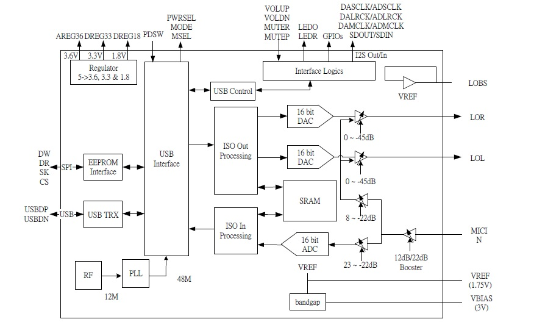
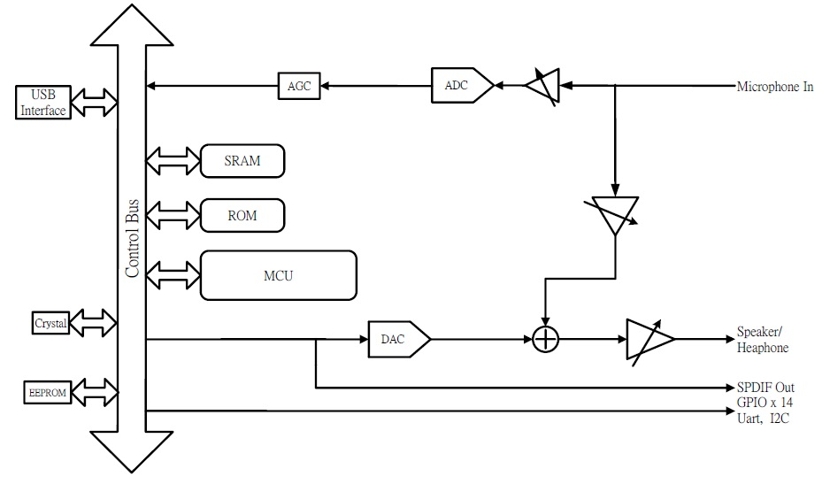
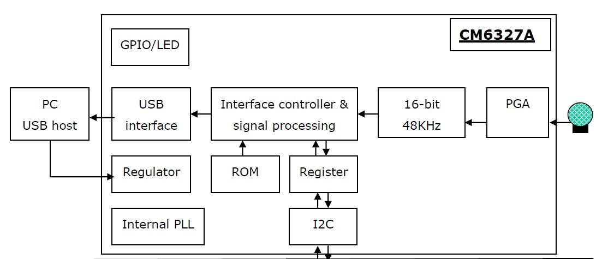

# [usb mic](https://github.com/Qful/mic) 

通过USB进行语音的输入

- [文档](docs/)
- [资源](src/)
- [工程](project/)

### [骅讯方案](https://www.cmedia.com.tw/) 

#### CM108B

#### CM6500B

#### CM6327A

### www.Qful.net
